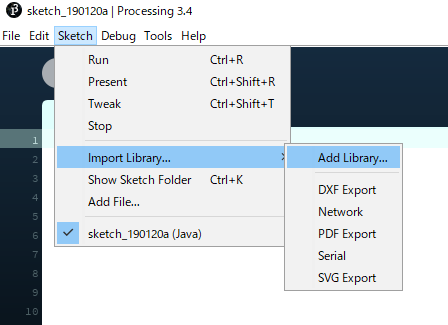

# oscP5
## URL
- www.sojamo.de/libraries/oscP5/

## how to install oscP5 library



## send
```
import oscP5.*;
import netP5.*;

OscP5 oscP5;

void setup() {
  // setup oscP5
  oscP5 = new OscP5(this, 12345);
}

void keyPressed() {
  if (keyCode == 0x20) sendOSCPacket();
}

void sendOSCPacket() {
  // create OSC message
  OscMessage msg = new OscMessage("/test");
  msg.add(1234);       // integer
  msg.add(123.456f);   // float
  msg.add("test1234"); // string

  NetAddress remote_addr = new NetAddress("127.0.0.1", 7777);

  // send OSC packet
  oscP5.send(msg, remote_addr);
}
```

## receive
```
import oscP5.*;
import netP5.*;

OscP5 oscP5;

void setup() {
  oscP5 = new OscP5(this, 7777);
}

void oscEvent(OscMessage msg) {
  String addr = msg.addrPattern();
  
  if ("/test".equals(addr) == false) {
    // error
    return;
  }
  
  String typetag = msg.typetag(); // "ifs"->int,float,string
  
  if ("ifs".equals(typetag) == false) {
    // error
    return;
  }
  
  int    val_i = msg.get(0).intValue();
  float  val_f = msg.get(1).floatValue();
  String val_s = msg.get(2).stringValue();
}
```


